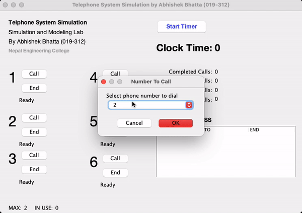
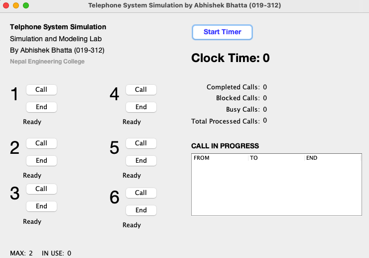

# Telephone Simulation

## Introduction

This project is a telephone simulation implemented in Java, created as part of the lab work for Nepal Engineering College.

## Project Overview

The telephone simulation aims to replicate the functionality of a basic telephone system, allowing users to make calls and end calls. The application provides a simple GUI to interact with the telephone functionalities.

## Features

- **Make a Call:** Users can dial a listed number and place a call to another user within the simulation.

- **Receive a Call:** Users can receive incoming calls and respond accordingly.

- **Call Duration**: Users are given an option to choose for the length of call. After the completion of that call, call will be ended automatically.

- **End Call:** Users have option to end their call.
- **Current Call History:** Current call history will be show in the table.

## Technologies Used

- Java

## Screenshot

## Contributing

Contributions to this telephone simulation project are welcome! If you find any issues or have ideas for enhancements, feel free to open an issue or submit a pull request.

## Acknowledgments

I would like to express my gratitude to my professors and classmates at Nepal Engineering College for their support and valuable feedback during the development of this project.

Have a great time simulating telephone operations! If you have any questions or need further assistance, feel free to contact me at abhishekb019312@nec.edu.np. Happy coding!
